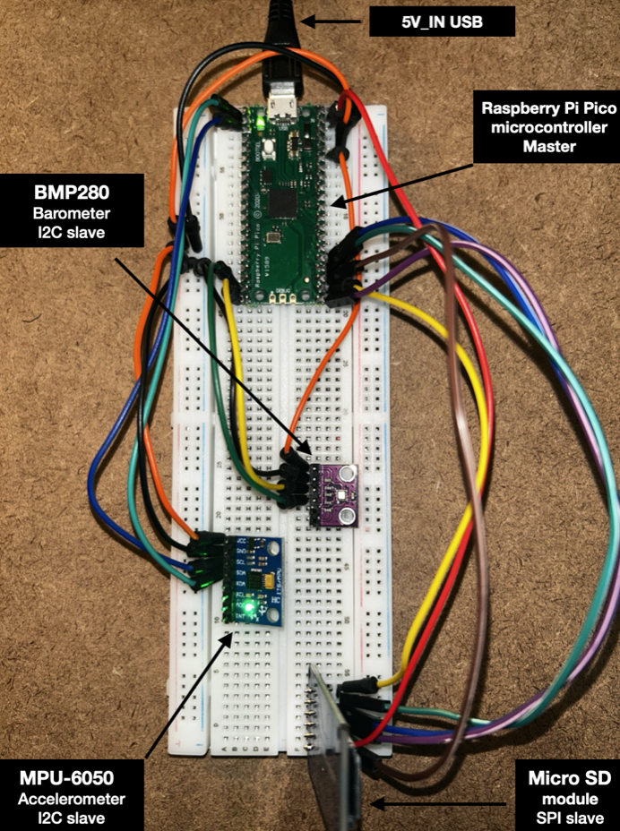
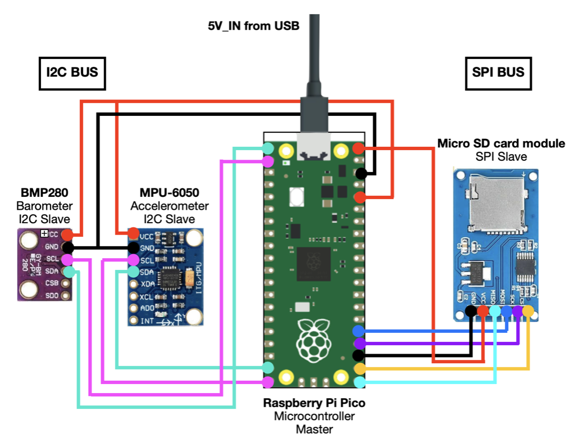
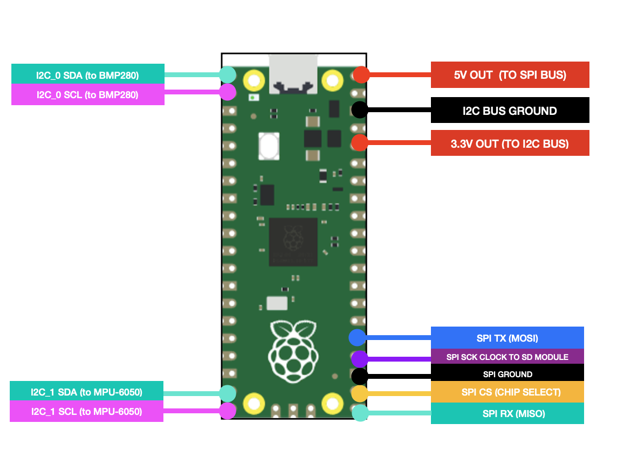

# Rocket Flight Data Acquisition System

## Overview

This project involves the development of a model rocket avionics system capable of collecting, storing, and analyzing flight performance data. The objective of the system is to provide quantitative flight feedback that enables data-driven design improvements, such as optimizing nose cone geometry, fin design, and weight distribution to improve overall rocket performance.

---
# Project Objectives

The system is being developed to:

- Measure rocket flight altitude and acceleration
- Collect and store flight data
- Support post-flight performance analysis to drive model rocket design improvements
  
---

# Current Project Status

## Completed

- ✅ System requirements development 
- ✅ System Functional Analysis
- ✅ System architecture development
- ✅ Initial avionics prototype developed  

## In Progress

- 🔄 Developmental testing (DT-03)
  
---

# Systems Engineering Approach

Following initial prototype development, the system is being matured using the following structured systems engineering process:

<a href="#performance-requirements">Performance Requirements</a>
 
↓
 
<a href="#functional-analysis">Functional Analysis</a>
 
↓
 
<a href="#functional-allocation">Functional Allocation</a>
 
↓
 
<a href="#physical-architecture">Physical Architecture</a>
 
↓
 
<a href="#component-selection--trade-off-analysis">Component Selection / Trade off Analysis</a>
 
↓
 
<a href="#prototype-development">Prototype Development</a>
 
↓
 
<a href="#verification-planning-and-testing">Verification Planning and Testing</a>
 
↓
 
<a href="#verification-test-results">Verification Test Results</a>
 
↓
 
<a href="#next-steps">Next steps</a>
 
↓
 
<a href="#lessons-learned">Lessons Learned</a>

This approach establishes traceability between system requirements, functions, components and the verification process.

---

# Performance Requirements

An estimation of the rocket trajectory - apogee, acceleration, velocity and total operation time (pre-launch to recovery) were made to develop these performance requirements for the flight of a 1:10 scale Nike Smoke rocket with a C6:5 engine. From the engine specifications sheet, the C6:5 will have a max thrust of 14.1 N, and it was determined that the rocket avionics system must withstand up to 15g Forces.

From these calculations, the apogee was estimated to be 412 meters, reached approximately 11.01 seconds after launch. With a minimum sampling rate of 45 Hz, the avionics system would acquire 495 pressure and acceleration samples upon reaching its apogee which satisfies an intial baseline performance for a minimum sampling rate. furthermore, at the selected sampling rate of 45 Hz, the rocket will vertically displace less than 2 meters per sample at its maximum expected velocity (89.88 meters/second), ensuring adequate resolution for flight data reconstruction.

In addition, the total operation time from pre-launch to recovery was estimated as 104 seconds. This total operation time drove the power capacity requirement. The power performance requirement was set to 180 seconds to provide a conservative time estimate in case of unexpected recovery delays.

The full calucations can be seen here: [Full Engineering Requirement Calculations](Calculations/req_calculations.pdf)

<table style="border-collapse: collapse; width: 100%; font-family: Arial, sans-serif;">
    <tr style="background-color:#c9c9c9;">
        <th colspan="2" align="left" style="padding:14px; font-size:28px; border:1px solid #999;">
            Performance Requirements
        </th>
    </tr>
    <tr>
        <td width="24%" valign="top" style="padding:14px; font-size:24px; font-weight:bold; border:1px solid #999;">
            REQ-01
        </td>
        <td style="padding:14px; font-size:22px; border:1px solid #999;">
            The system shall accept a user-initiated power-on command through the designated power switch.
        </td>
    </tr>
    <tr>
        <td valign="top" style="padding:14px; font-size:24px; font-weight:bold; border:1px solid #999;">
            REQ-02
        </td>
        <td style="padding:14px; font-size:22px; border:1px solid #999;">
            The system shall sample barometric pressure at a minimum rate of 45 Hz during powered ascent, coast, and descent.
        </td>
    </tr>
    <tr>
        <td valign="top" style="padding:14px; font-size:24px; font-weight:bold; border:1px solid #999;">
            REQ-03
        </td>
        <td style="padding:14px; font-size:22px; border:1px solid #999;">
            The system shall sample three-axis acceleration at a minimum rate of 45 Hz from launch detection until end of flight logging.
        </td>
    </tr>
    <tr>
        <td valign="top" style="padding:14px; font-size:24px; font-weight:bold; border:1px solid #999;">
            REQ-04
        </td>
        <td style="padding:14px; font-size:22px; border:1px solid #999;">
            The system shall assign timestamps to all measurements with a resolution of ≤22.2 ms.
        </td>
    </tr>
    <tr>
        <td valign="top" style="padding:14px; font-size:24px; font-weight:bold; border:1px solid #999;">
            REQ-05
        </td>
        <td style="padding:14px; font-size:22px; border:1px solid #999;">
            The system shall record all acquired timestamped sensor measurements to onboard storage.
        </td>
    </tr>
    <tr>
        <td valign="top" style="padding:14px; font-size:24px; font-weight:bold; border:1px solid #999;">
            REQ-06
        </td>
        <td style="padding:14px; font-size:22px; border:1px solid #999;">
            The system shall remain fully functional after exposure to shock loads up to 15g peak acceleration and vibration representative of model rocket ignition and ascent.
        </td>
    </tr>
    <tr>
        <td valign="top" style="padding:14px; font-size:24px; font-weight:bold; border:1px solid #999;">
            REQ-07
        </td>
        <td style="padding:14px; font-size:22px; border:1px solid #999;">
            The system shall support continuous operation for at least 180 seconds of active logging time.
        </td>
    </tr>
    <tr>
        <td valign="top" style="padding:14px; font-size:24px; font-weight:bold; border:1px solid #999;">
            REQ-08
        </td>
        <td style="padding:14px; font-size:22px; border:1px solid #999;">
            The system shall ensure the rocket center of gravity remains at least 1.0 body diameter forward of the center of pressure for all flight configurations.
        </td>
    </tr>
</table>

---

# Functional Analysis 
After developing the performance requirements, functions were developed to satisfy the performance requirements. A functional block diagram was developed to model the function flow and point-out all interfaces.

## Functional Allocation
After modeling the functions in the functional block diagram, the functions were traced to their corresponding requirements in a functional traceability matrix to ensure that all requirements are met.

<table width="100%">
  <tr>
    <td width="65%" align="center">
      <strong>Functional Traceability Matrix</strong> 
      
    </td>
    <td width="35%" align="left" valign="top">
      <strong>Summarized Requirements</strong>
<ul>
  <li><strong>REQ-01</strong> User power control</li>
  <li><strong>REQ-02</strong> Pressure acquisition ≥45 Hz</li>
  <li><strong>REQ-03</strong> Acceleration acquisition ≥45 Hz</li>
  <li><strong>REQ-04</strong> Timestamp resolution ≤22.2 ms</li>
  <li><strong>REQ-05</strong> Onboard sensor data storage</li>
  <li><strong>REQ-06</strong> 15g shock/vibration survivability</li>
  <li><strong>REQ-07</strong> 180 seconds operational duration</li>
  <li><strong>REQ-08</strong> CG margin ≥1D forward of CP</li>
</ul>
    </td>
  </tr>
</table>

---

# Physical Architecture

After conducting a functional analysis, the system's physical architecture was defined and components were mapped to specific functions in an architecture allocation matrix to ensure that the selected physical architecture met the defined system functions.

<strong>Physical Architecture Allocation Matrix</strong> 

---

# Component Selection / Trade off Analysis

### Component Selection Method

- Component selection was performed using the **Subjective Value Method**, a systems engineering trade study approach described in *Systems Engineering Principles and Practice* by Kossiakoff et al.
- Candidate components were evaluated against various different criterion.
- Each criterion was assigned a **value** from **1–5**:
  - **1** = Poor
  - **2** = Fair
  - **3** = Satisfactory
  - **4** = Good
  - **5** = Superior
- Each candidate component was assigned a **weight** for each criterion based on its relative performance (total weight = **100%**).
- Candidate scores were calculated using:

  **Score = Weight × Value**

- Total scores were compared to identify the preferred component for system integration.

The graphs comparing each candidate component can be seen below.

[More details on component selection and specification can be found here](Component%20Selection/component%20selection.md).

<table>
  <tr>
    <td width="60%" align="center">
      
    </td>
    <td width="40%" valign="top">

### Microcontroller Selection

Three microcontrollers were evaluated against the project requirements for flash memory, weight, cost, BUS speed, and number of BUS channels. The **Raspberry Pi Pico** was selected as the system's microcontroller because it provides sufficient processing performance to sample and timestamp multiple sensors with a resolution of ≤22.2 ms (REQ-04
) while being light weight and low cost.

</td>
  </tr>

  <tr>
    <td width="60%" align="center">
      
    </td>
    <td width="40%" valign="top">

### Accelerometer Selection

Three inertial measurement units were compared using acceleration range, weight, Output Data Rate (ODR), and cost. The **MPU-6050** was selected because it is the cheapest alternative that still meets the performance requirements - specifically on achieving a minimum sampling rate of 45 Hz (REQ-03). The MPU 6050 meets the performance requirement of measuring acceleration up to 15g (REQ-06) while being a lightweight sensor.

</td>
  </tr>

  <tr>
    <td width="60%" align="center">
      
    </td>
    <td width="40%" valign="top">

### Pressure Sensor Selection

Pressure sensors were evaluated based on pressure accuracy, weight, output data rate, and cost. The **BMP280** was selected due to its ability to successfully satisfy accurate pressure measurements at a minimum sampling rate of 45 hz (REQ-02) at the lowest cost. These characteristics make it well suited for estimating rocket altitude while remaining within the project's size, weight, and budget constraints.

</td>
  </tr>
</table>

---

# Prototype Development

The initial prototype demonstrates:

- Microcontroller-based flight data acquisition
- I²C sensor communication
- SPI data storage
- Embedded flight data logging

## Prototype Hardware Configuration

| Component | Function |
|---|---|
| Raspberry Pi Pico | Flight computer |
| BMP280 | Barometric Pressure sensing |
| MPU6500 | 3-axis acceleration measurement |
| MicroSD Module | Flight data storage |
| Battery System | Distributed Power source |

## Initial Prototype

<table>
  <tr>
    <td align="center">
      <strong>Prototype CAD Model</strong>
      

        
      

      

        <small>CAD model used to define avionics packaging and mechanical integration.</small>
      

    </td>
    <td align="center">
      <strong>Initial Hardware Integration</strong>
      

        
      

      

        <small>Breadboard prototype used to validate sensor communication and data acquisition.</small>
      

    </td>
    <td align="center">
      <strong>Avionics Bay</strong>
      

        
      

      

        <small>Final integrated avionics assembly and mechanical enclosure.</small>
      

    </td>
  </tr>
</table>

<strong>Hardware Integration Details</strong>

  <table>
  <tr>
    <td align="center">
      <strong>Avionics system wiring diagram</strong>
      

        
      

      

        <small></small>
      

    </td>
    <td align="center">
      <strong>Microcontroller pinout diagram</strong>
      

        
      

      

        <small></small>
      

    </td>
  </tr>
 </table>

----

# Verification Planning and Testing

After determining the appropriate hardware to utilize and assembling a prototype, a verification and developmental test process was conducted to ensure all of the requirments were met at the required standard. Below is the Integrated Test Program from the Test and Evaluation Master Plan (TEMP) as well as the Verificaiton Cross-Reference Matrix.

[The full TEMP can be seen here.](Verification/verification.md#test-and-evaluation-master-plan-temp)

<h2>Integrated Test Program</h2>

The integrated test program evaluates avionics system performance through 
incremental developmental testing followed by future operational testing.

<table>
<tr>
<th>Category</th>
<th>Summary</th>
</tr>

<tr>
<td>Integrated Test Program</td>
<td>
<table>
<tr>
<th>Test ID</th>
<th>Description</th>
<th>Status</th>
</tr>

<tr>
<td>DT-01</td>
<td>Data acquisition rate, timestamping, and data storage verification</td>
<td>Complete</td>
</tr>

<tr>
<td>DT-02</td>
<td>Continuous operation and 180-second storage verification</td>
<td>Complete</td>
</tr>

<tr>
<td>DT-03</td>
<td>Shock and acceleration load verification up to 15g</td>
<td>Planned</td>
</tr>

<tr>
<td>OT-01</td>
<td>Integrated rocket flight test and mission performance evaluation</td>
<td>Planned</td>
</tr>

</table>
</td>
</tr>

</table> 

## Verification Cross-Reference Matrix (VCRM)

<table>
  <tr>
    <th>REQ ID</th>
    <th>Requirement Description</th>
    <th>Verification Method</th>
    <th>Supporting Documents / Notes</th>
    <th>Pass / Fail Status</th>
  </tr>

  <tr>
    <td><b>REQ   -01</b></td>
    <td>System accepts user ON/OFF input</td>
    <td>Test      [DT-01]</td>
    <td>user input success</td>
    <td><b>Pass</b></td>
  </tr>

  <tr>
    <td><b>REQ   -02</b></td>
    <td>System samples barometric pressure at 45 Hz</td>
    <td>Test      [DT-01]</td>
    <td><a href="Verification/verification.md#developmental-test-01-dt-01">Developmental Test 01 Results</a></td>
    <td><b>Pass</b></td>
  </tr>

  <tr>
    <td><b>REQ   -03</b></td>
    <td>System samples 3-axis acceleration at 45 Hz</td>
    <td>Test      [DT-01]</td>
    <td><a href="Verification/verification.md#developmental-test-01-dt-01">Developmental Test 01 Results</a></td>
    <td><b>Pass</b></td>
  </tr>

  <tr>
    <td><b>REQ   -04</b></td>
    <td>System timestamps data at 22.2 ms intervals</td>
    <td>Test      [DT-01]</td>
    <td><a href="Verification/verification.md#developmental-test-01-dt-01">Developmental Test 01 Results</a></td>
    <td><b>Pass</b></td>
  </tr>

  <tr>
    <td><b>REQ   -05</b></td>
    <td>System stores data to onboard micro SD card module</td>
    <td>Test      [DT-01]</td>
    <td><a href="Verification/verification.md#developmental-test-01-dt-01">Developmental Test 01 Results</a></td>
    <td><b>Pass</b></td>
  </tr>

  <tr>
    <td><b>REQ   -06</b></td>
    <td>System maintains function across forces up to 15g</td>
    <td>Test      [DT-03]</td>
    <td> Planning</td>
    <td><b>Pending</b></td>
  </tr>

  <tr>
    <td><b>REQ   -07</b></td>
    <td>Continuous data logging for 180 seconds</td>
    <td>Test      [DT-02]</td>
    <td><a href="Verification/verification.md#developmental-test-02-dt-02">Developmental Test 02 Results</a></td>
    <td><b>Pass</b></td>
  </tr>

  <tr>
    <td><b>REQ   -08</b></td>
    <td>System maintains rocket CG aft of CP by 49 mm</td>
    <td>Analysis</td>
    <td> Planning </td>
    <td><b>Pending</b></td>
  </tr>

</table>

---

# Verification Test Results

## [DT-01] Developmental Test Results

Developmental Test 01 (DT-01) evaluated the performance of the avionics system prototype during a controlled altitude change test. The system was powered on at the base of a standard 3-meter staircase and transported to the top of the staircase to simulate an increase in altitude. After a brief static hold period at the maximum elevation point, the prototype was lowered approximately 1.5 meters and paused before returning to the original starting position. Sensor data collected throughout the test was analyzed to evaluate altitude measurement response and system performance during ascent, descent, and static conditions.[DT-01 full test report](Verification/verification.md#developmental-test-01-dt-01)

DT-01 verified data acquisition performance, timestamping, data storage, and continuous operation. DT-01 achieved an average sampling frequency of 66.7 Hz with a 15 ms sample interval. 

<table>
  <tr>
    <!-- Graph -->
    <td width="70%" align="center">
      <h3>DT-01 Altitude Test Results</h3>
      
    </td>
    <!-- Data Table -->
    <td width="30%" align="center">
      <h3>DT-01 Test Procedure</h3>
      <ul style="margin: 0;">
      <li>System powered on at the base of a 3-meter staircase.</li>
      <li>Prototype moved to the top of the staircase to simulate ascent.</li>
      <li>System held at maximum elevation for steady-state measurement.</li>
      <li>Prototype lowered 1.5 meters to evaluate descent response.</li>
      <li>Prototype returned to the starting position.</li>
      <li>Altitude data analyzed for sensor response and repeatability.</li>
      </ul>
    </td>
  </tr>
</table>

This system verified the following requirements:

- ✅ REQ-01: The system succesfully accepted the ON/OFF command from the user - component requirement satisfied by a switch on the power source.
- ✅ REQ-02: The system acquired pressure measurements which were converted to altitude values. The average sampling rate across the pressure measurements was 67 Hz (67 samples/sec) 
- ✅ REQ-03: The system acquired 3-axis acceleration measurements. The sampling rate across the acceleration measurements was 67 Hz (67 samples/sec).  
- ✅ REQ-04: The system succesfully timestamped all data measurements at an average interval of 15 ms.
- ✅ REQ-05: The system succesfully stored all of the data to a CSV in the onboard micro SD card.

## [DT-02] Developmental Test Results

Developmental Test 02 [DT-02] assessed the data storage capacity from REQ-07. [DT-02 full test report](Verification/verification.md#developmental-test-02-dt-02)

<table>
  <tr>
    <!-- Graph -->
    <td width="70%" align="center">
      <h3>DT-02 Altitude Test Results</h3>
      
    </td>
    <!-- Data Table -->
    <td width="30%" align="center">
      <h3>DT-02 Test Procedure</h3>
      <ul style="margin: 0;">
      <li>System initialized and configured prior to testing.</li>
      <li>Prototype subjected to the defined test scenario to evaluate functional performance.</li>
      <li>Sensor data collected and stored for post-test analysis.</li>
      <li>Recorded data analyzed against applicable performance requirements.</li>
      <li>Results used to verify system compliance and identify areas for improvement.</li>
      </ul>
    </td>
  </tr>
</table>

This system verified the following requirements:

- ✅ REQ-07: The system succesfully stored 180 seconds of sensor data.

---

# Next Steps

## Moving forward to V1.1:
Building on flight data acquisition system V1.0, further developmental testing (DT-03) will be completed for structural integrity and the verification of REQ-06. Also, simulations will be conducted to ensure that the embedded avionics system satisfies the center of gravity requirement (REQ-08), ensuring in-flight rocket stability. 

Upon completion and success of developmental testing and verification, an initial operational test (OT-01) will be conducted to test the complete embedded system and analyze the flight of a 1:10 Nike Smoke model rocket on a C6:5 engine. 

In addition, further trade studies and component selection will be conducted to make incremental advances on the performance of this avionics system, with the priority given to accelerometer optimization due to the noise observed in the test data on DT-01.

--- 

# Lessons Learned

This project provided valuable experience in developing an embedded avionics system from requirements definition through verification. Key lessons learned include the importance of requirements traceability, iterative testing, and early identification of design limitations. The project strengthened my practical understanding of embedded communication protocols (I2C and SPI), sensor integration, data quality analysis, and the impact of mechanical design decisions on rocket stability and system performance.

[Back to Top](#systems-engineering-approach)

