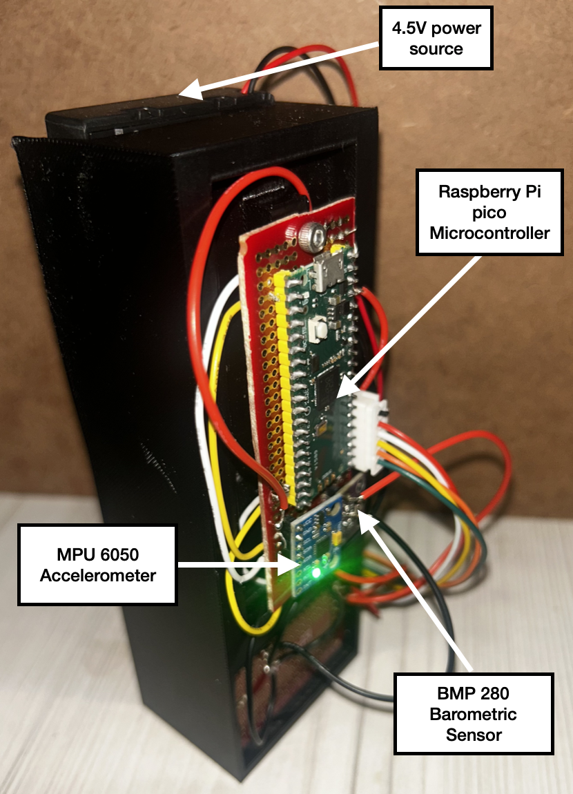
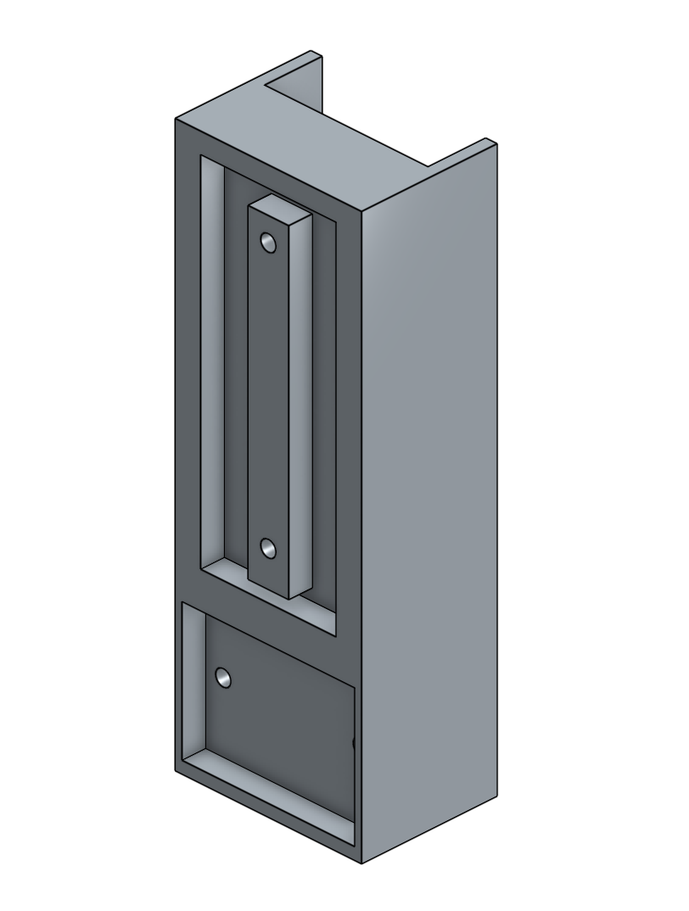
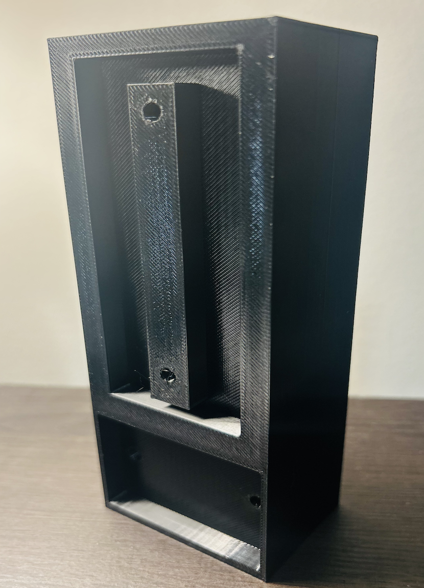

# 🚀 Rocket Flight Data Acquisition System

## Overview

This project involves the development of a model rocket avionics system designed to collect, store, and analyze flight data.

An initial prototype was developed to demonstrate technical feasibility of embedded sensor integration and flight data acquisition. Following prototype development, a formal systems engineering process is being applied to define requirements, establish architecture, and develop verification methods.

---

# Project Objectives

The system is being developed to:

- Measure rocket altitude and 3-axis acceleration during flight
- Collect and store flight data
- Support post-flight flight performance analysis
- Demonstrate a requirements-based systems engineering workflow

---

# Current Project Status

**Current Phase: System Definition and Design Maturation**

## Completed

- ✅ Initial avionics prototype developed  
- ✅ System requirement development 
- ✅ Functional Decomposition and traceability
- ✅ System architecture development (physical architecture traceability to functions)

## In Progress

- 🔄 Trade Studies
- 🔄 Verification and Validation (V&V) 


---

# Prototype Overview

The initial prototype demonstrates:

- Microcontroller-based flight data acquisition
- I²C sensor communication
- SPI data storage
- Embedded flight data logging

## Prototype Hardware Configuration

| Component | Function |
|---|---|
| Raspberry Pi Pico | Flight computer |
| BMP280 | Barometric altitude sensing |
| MPU6500 | 3-axis acceleration measurement |
| MicroSD Module | Flight data storage |
| Battery System | Distributed Power source |

## Initial Prototype
<table>
  <tr>
    <td align="center">
      <strong>Prototype</strong><br>
      
    </td>
    <td align="center">
      <strong>CAD avionics bay</strong><br>
      
    </td>
    <td align="center">
      <strong>Avionics Bay</strong><br>
      
    </td>
  </tr>
</table>


---

# Systems Engineering Approach

Following initial prototype development, the system is being matured using the following structured systems engineering process:

```
System Requirements
        ↓
Functional Analysis
        ↓
System Architecture
        ↓
Trade Studies
        ↓
Verification and Validation
```
This approach establishes traceability between system requirements, functions, components and the verification process.

---
# System Requirements

The requirements process started with operational requirements and got more refined moving to system requirements > performance requirements > component requirments 

## Performance requirements


---
# Functional Analysis 


## Functional Traceability Matrix

<table width="100%">
  <tr>
    <td width="65%" align="center">
      <strong>Functional Traceability Matrix</strong><br>
      
    </td>
    <td width="35%" align="left" valign="top">
      <strong>Requirements</strong>
      <ul style="font-size: 11px; line-height: 1.2;">
        <li><strong>REQ-001:<strong> The system shall accept a user-initiated power-on command through the designated power switch.</li>
        <li><strong>REQ-002:<strong> The system shall sample atmospheric pressure at a minimum rate of 45 Hz during powered ascent, coast, and descent.</li>
        <li><strong>REQ-003:<strong> The system shall sample three-axis acceleration at a minimum rate of 45 Hz from launch detection until end of flight logging.</li>
        <li><strong>REQ-004:<strong> The system shall assign timestamps to all measurements with a resolution of ≤22.2 ms.</li>
        <li><strong>REQ-005:<strong> The system shall record all acquired timestamped sensor measurements to onboard storage.</li>
        <li><strong>REQ-006:<strong> The system shall remain fully functional after exposure to shock loads up to 15g peak acceleration and vibration representative of model rocket ignition and ascent.</li>
        <li><strong>REQ-007:<strong> The system shall support continuous operation for at least 3 minutes of active logging time.</li>
        <li><strong>REQ-008:<strong> The system shall ensure the rocket center of gravity remains at least 1.0 body diameter forward of the center of pressure for all flight configurations.</li>
      </ul>
    </td>
  </tr>
</table>

# System Architecture

## Physical Architecture
<strong>Physical Architecture Allocation Matrix</strong><br>

---

# Trade Studies


